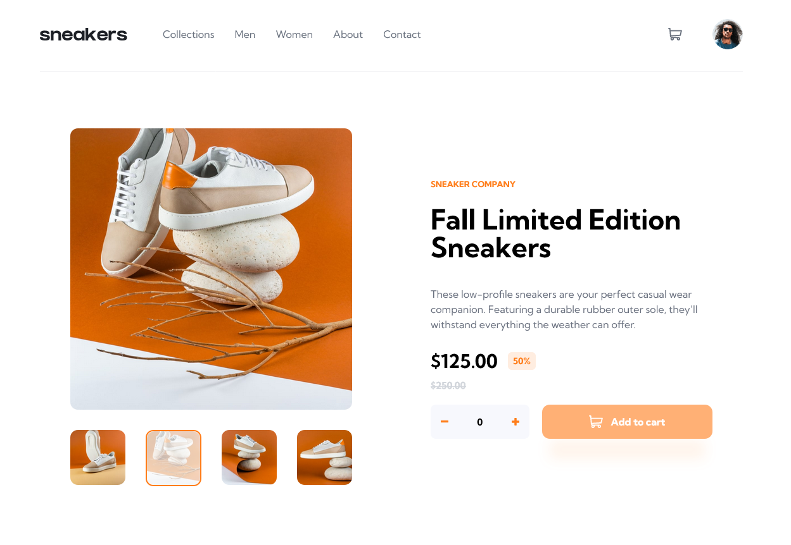

# E-commerce product page solution

         

This is a solution to the [E-commerce product page challenge on Frontend Mentor](https://www.frontendmentor.io/challenges/ecommerce-product-page-UPsZ9MJp6). Frontend Mentor challenges help you improve your coding skills by building realistic projects.

## Table of contents

-   [Overview](#overview)
    -   [The challenge](#the-challenge)
    -   [Screenshots](#screenshots)
    -   [Links](#links)
-   [My process](#my-process)
    -   [Built with](#built-with)
    -   [What I learned](#what-i-learned)
    -   [Useful resources](#useful-resources)
-   [Author](#author)

## Overview

### The challenge

Users should be able to:

-   View the optimal layout for the site depending on their device's screen size
-   See hover states for all interactive elements on the page
-   Open a lightbox gallery by clicking on the large product image
-   Switch the large product image by clicking on the small thumbnail images
-   Add items to the cart
-   View the cart and remove items from it

### Screenshots

### Links

-   [Solution URL](https://github.com/adamhm/frontend-mentor-challenges/tree/main/ecommerce-product-page-main)
-   [Live Site URL](https://adamhm.github.io/fm/ecommerce-product-page/)

## My process

### Built with

-   [Visual Studio Code](https://code.visualstudio.com/) - IDE
-   Semantic HTML5 markup
-   [TailwindCSS](https://tailwindcss.com/) - for styles
-   Flexbox
-   [Typescript](https://typescriptlang.org/)
-   [React](https://reactjs.org/) - JS library
-   [Framer Motion](https://www.framer.com/motion/) - animation
-   [ESLint](https://eslint.org/) - for linting
-   [Prettier](https://prettier.io/) - code formatting
-   [Vite](https://vitejs.dev) - as build tool
-   [npm](https://npmjs.org) - package manager

### What I learned

-   How to create custom hooks...
-   How to separate concerns in React components with custom hooks...

### Useful resources

-   [Separation of concerns with React hooks](https://felixgerschau.com/react-hooks-separation-of-concerns/)

## Author

-   [Website](https://adamhm.github.io)
