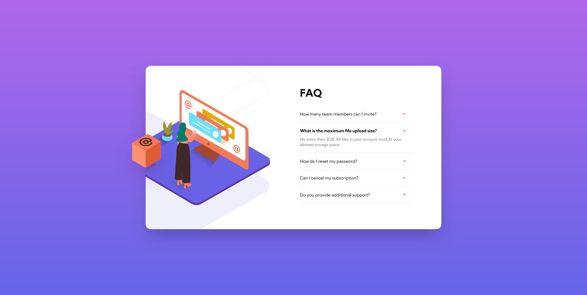

    
    

<h1 style="text-align: center">FAQ accordion card solution</h1>

 

     

This is a solution to the [FAQ accordion card challenge on Frontend Mentor](https://www.frontendmentor.io/challenges/faq-accordion-card-XlyjD0Oam). Frontend Mentor challenges help you improve your coding skills by building realistic projects.

## Table of contents

-   [Overview](#overview)
    -   [The challenge](#the-challenge)
    -   [Screenshots](#screenshots)
    -   [Links](#links)
-   [My process](#my-process)
    -   [Built with](#built-with)
    -   [What I learned](#what-i-learned)
-   [Author](#author)

## Overview

### The challenge

Users should be able to:

-   View the optimal layout for the component depending on their device's screen size
-   See hover states for all interactive elements on the page
-   Hide/Show the answer to a question when the question is clicked

### Screenshots

### Links

-   [Solution URL](https://github.com/adamhm/frontend-mentor-challenges/tree/main/faq-accordion-card-main/react-ts-tailwind)
-   [Live Site URL](https://adamhm.github.io/fm/faq-accordion-card/react-ts-tailwind/)

## My process

### Built with

-   [Visual Studio Code](https://code.visualstudio.com/) - IDE
-   Semantic HTML5 markup
-   [TailwindCSS](https://tailwindcss.com/) - styling
-   Flexbox
-   [Typescript](https://typescriptlang.org/)
-   [React](https://reactjs.org/) - JS library
-   [Prettier](https://prettier.io/) - code formatting

### What I learned

-   How to configure TailwindCSS to use multiple background images...

## Author

-   [Website](https://adamhm.github.io)
