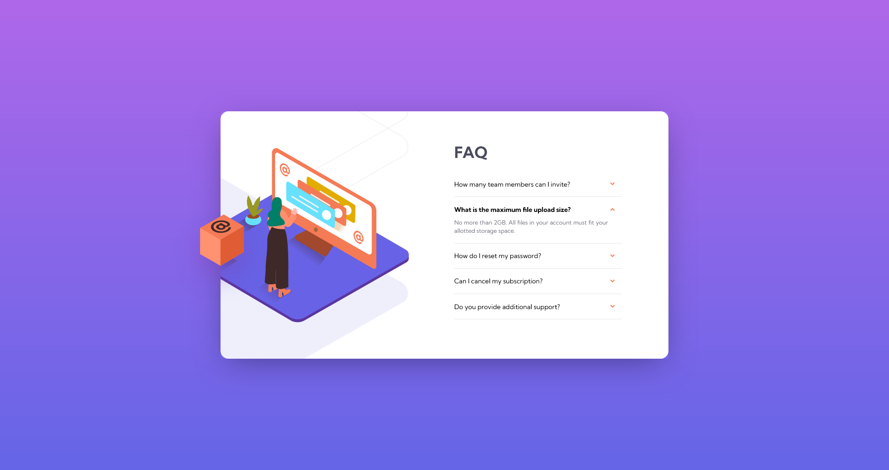

    
    

<h1 style="text-align: center">FAQ accordion card solution</h1>

 

   

This is a solution to the [FAQ accordion card challenge on Frontend Mentor](https://www.frontendmentor.io/challenges/faq-accordion-card-XlyjD0Oam). Frontend Mentor challenges help you improve your coding skills by building realistic projects.

## Table of contents

-   [Overview](#overview)
    -   [The challenge](#the-challenge)
    -   [Screenshots](#screenshots)
    -   [Links](#links)
-   [My process](#my-process)
    -   [Built with](#built-with)
    -   [What I learned](#what-i-learned)
-   [Author](#author)

## Overview

### The challenge

Users should be able to:

-   View the optimal layout for the component depending on their device's screen size
-   See hover states for all interactive elements on the page
-   Hide/Show the answer to a question when the question is clicked

### Screenshots

### Links

-   [Solution URL](https://github.com/adamhm/frontend-mentor-challenges/tree/main/faq-accordion-card-main/vanilla-css-js)
-   [Live Site URL](https://adamhm.github.io/fm/faq-accordion-card/vanilla-css-js/)

## My process

### Built with

-   Semantic HTML5 markup
-   CSS3 styles
-   Flexbox

### What I learned

-   How to use multiple background images...
-   How to use pseudo elements...
-   How to use the @supports feature query to add style rules depending on browser support...

## Author

-   [Website](https://adamhm.github.io)
