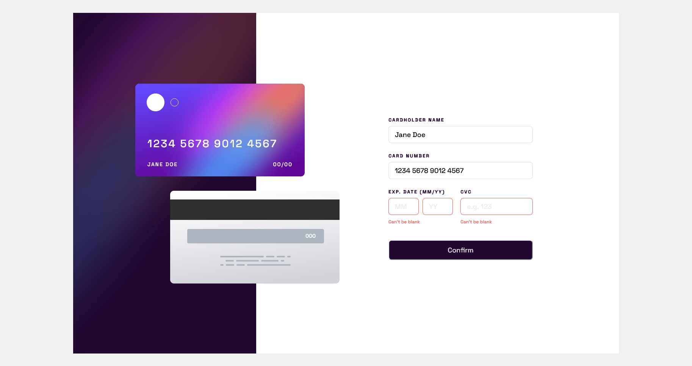

    
    

<h1 style="text-align: center">Interactive card details form solution (Vanilla JS)</h1>

 

     

This is a solution to the [Interactive card details form challenge on Frontend Mentor](https://www.frontendmentor.io/challenges/interactive-card-details-form-XpS8cKZDWw). Frontend Mentor challenges help you improve your coding skills by building realistic projects.

## Table of contents

-   [Overview](#overview)
    -   [The challenge](#the-challenge)
    -   [Screenshot](#screenshot)
    -   [Links](#links)
-   [My process](#my-process)
    -   [Built with](#built-with)
    -   [Useful resources](#useful-resources)
-   [Author](#author)

## Overview

### The challenge

Users should be able to:

-   Fill in the form and see the card details update in real-time
-   Receive error messages when the form is submitted if:
    -   Any input field is empty
    -   The card number, expiry date, or CVC fields are in the wrong format
-   View the optimal layout depending on their device's screen size
-   See hover, active, and focus states for interactive elements on the page

### Screenshot

### Links

-   [Solution URL](https://github.com/adamhm/frontend-mentor-challenges/tree/main/interactive-card-details-form-main/vanilla-js)
-   [Live Site URL](https://adamhm.github.io/fm/interactive-card/vanilla-js/)

## My process

### Built with

-   Semantic HTML5 markup
-   SCSS for styles
-   Flexbox
-   Vanilla JavaScript
-   Gulp for compiling Sass to CSS

### Useful resources

-   [Sass Documentation](https://sass-lang.com/documentation/) - Simple examples, easy to understand. I'd recommend it to anyone still learning Sass.

## Author

-   [Website](https://adamhm.github.io)
