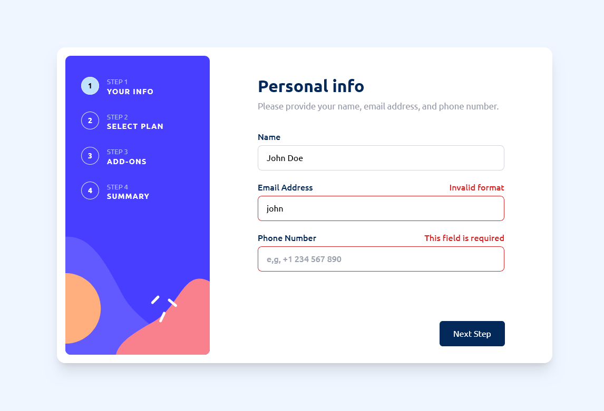

# Multi-step form solution

        

This is a solution to the [Multi-step form challenge on Frontend Mentor](https://www.frontendmentor.io/challenges/multistep-form-YVAnSdqQBJ). Frontend Mentor challenges help you improve your coding skills by building realistic projects.

## Table of contents

-   [Overview](#overview)
    -   [The challenge](#the-challenge)
    -   [Screenshot](#screenshot)
    -   [Links](#links)
-   [My process](#my-process)
    -   [Built with](#built-with)
    -   [What I learned](#what-i-learned)
    -   [Useful resources](#useful-resources)
-   [Author](#author)

## Overview

### The challenge

Users should be able to:

-   Complete each step of the sequence
-   Go back to a previous step to update their selections
-   See a summary of their selections on the final step and confirm their order
-   View the optimal layout for the interface depending on their device's screen size
-   See hover and focus states for all interactive elements on the page
-   Receive form validation messages if:
    -   A field has been missed
    -   The email address is not formatted correctly
    -   A step is submitted, but no selection has been made

### Screenshot

### Links

-   [Solution URL](https://github.com/adamhm/frontend-mentor-challenges/tree/main/multi-step-form-main/multi-step-form-react-ts-tailwind)
-   [Live Site URL](https://adamhm.github.io/fm/multi-step-form/)

## My process

### Built with

-   [Visual Studio Code](https://code.visualstudio.com/) - IDE
-   Semantic HTML5 markup
-   [TailwindCSS](https://tailwindcss.com/) - for styles
-   Flexbox
-   [Typescript](https://typescriptlang.org/)
-   [React](https://reactjs.org/) - JS library
-   [ESLint](https://eslint.org/) - for linting
-   [Prettier](https://prettier.io/) - code formatting
-   [Vite](https://vitejs.dev) - as build tool
-   [npm](https://npmjs.org) - package manager

### What I learned

-   How to create an accessible toggle button...
-   How to iterate over object keys in TypeScript...

### Useful resources

-   [How to Iterate Over Object Keys in TypeScript](https://www.totaltypescript.com/iterate-over-object-keys-in-typescript) - A nice post about how to handle Object.keys in Typescript to have type-safer code.
-   [Building accessible toggle buttons](https://joshcollinsworth.com/blog/accessible-toggle-buttons) - This is an amazing article which helped me to create accessible toggle buttons.

## Author

-   [Website](https://adamhm.github.io)
