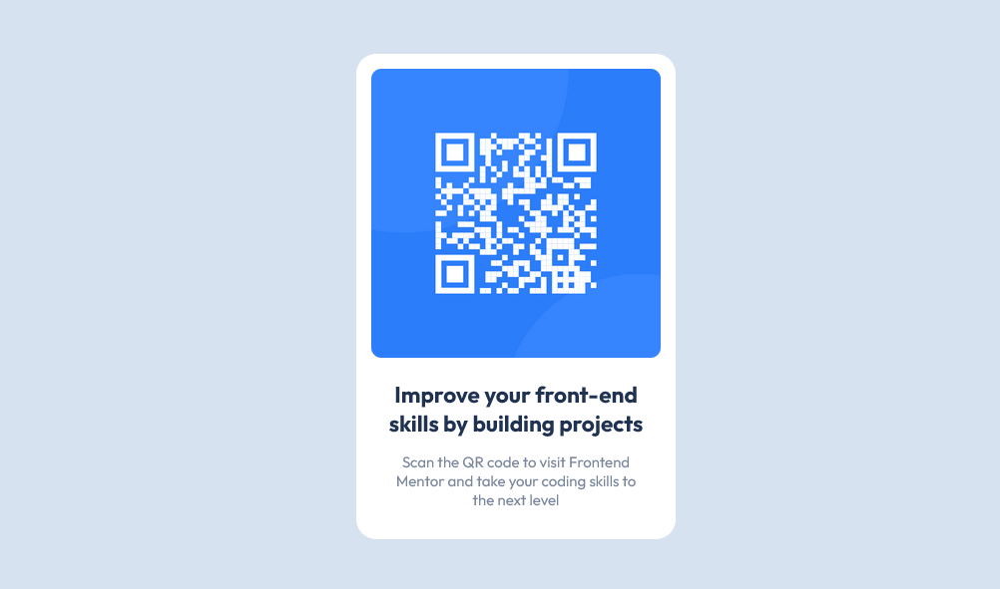

# QR code component solution (Vanilla CSS)

  

This is a solution to the [QR code component challenge on Frontend Mentor](https://www.frontendmentor.io/challenges/qr-code-component-iux_sIO_H). Frontend Mentor challenges help you improve your coding skills by building realistic projects.

## Table of contents

-   [Overview](#overview)
    -   [Screenshot](#screenshot)
    -   [Links](#links)
-   [My process](#my-process)
    -   [Built with](#built-with)
-   [Author](#author)

## Overview

### Screenshot

### Links

-   Solution URL: [Add solution URL here](https://github.com/adamhm/frontend-mentor-challenges/tree/main/qr-code-component-main/vanilla-css)
-   Live Site URL: [Add live site URL here](https://adamhm.github.io/fm/qrcode/vanilla-css/)

## My process

### Built with

-   [Visual Studio Code](https://code.visualstudio.com/) - IDE
-   Semantic HTML5 markup
-   CSS
-   Flexbox

## Author

-   [Website](https://adamhm.github.io)
