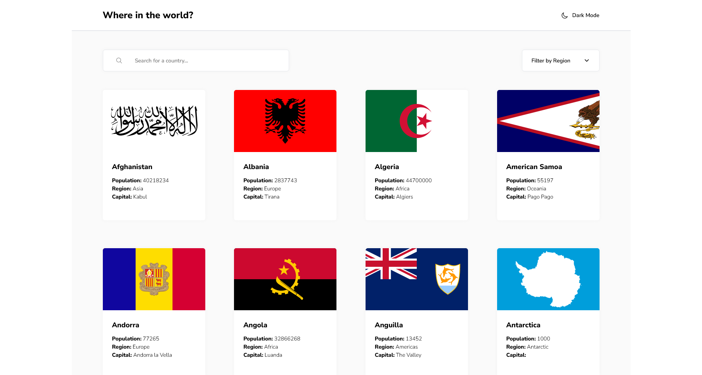
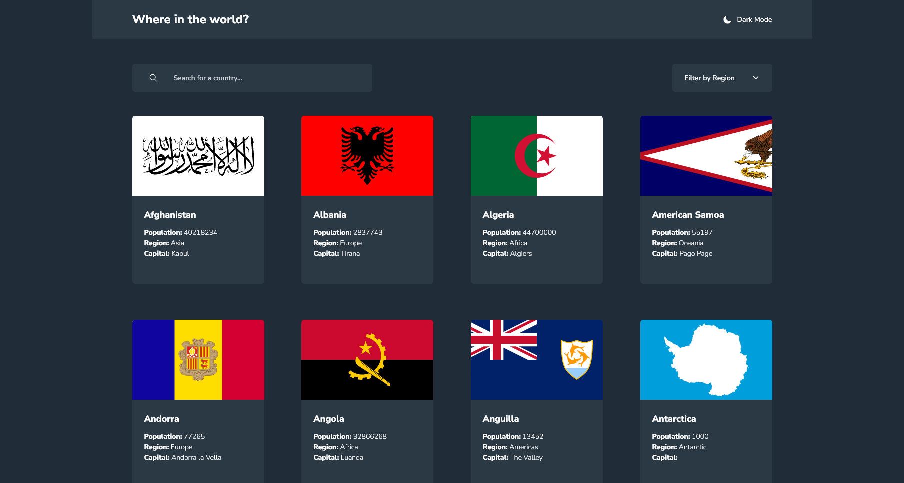

    
    

<h1 style="text-align: center">REST Countries API with color theme switcher solution</h1>

 

          

This is a solution to the [REST Countries API with color theme switcher challenge on Frontend Mentor](https://www.frontendmentor.io/challenges/rest-countries-api-with-color-theme-switcher-5cacc469fec04111f7b848ca). Frontend Mentor challenges help you improve your coding skills by building realistic projects.

## Table of contents

-   [Overview](#overview)
    -   [The challenge](#the-challenge)
    -   [Screenshots](#screenshot)
    -   [Links](#links)
-   [My process](#my-process)
    -   [Built with](#built-with)
    -   [Useful resources](#useful-resources)
-   [Author](#author)

## Overview

### The challenge

Users should be able to:

-   See all countries from the API on the homepage
-   Search for a country using an `input` field
-   Filter countries by region
-   Click on a country to see more detailed information on a separate page
-   Click through to the border countries on the detail page
-   Toggle the color scheme between light and dark mode

### Screenshots

### Links

-   [Solution URL](https://github.com/adamhm/frontend-mentor-challenges/tree/main/rest-countries-api-with-color-theme-switcher/rest-countries-api-react-ts-tailwind)
-   [Live Site URL](https://adamhm.github.io/fm/rest-countries-api/)

## My process

### Built with

-   [Visual Studio Code](https://code.visualstudio.com/) - IDE
-   Semantic HTML5 markup
-   [TailwindCSS](https://tailwindcss.com/) - styling
-   Flexbox
-   CSS Grid
-   [Typescript](https://typescriptlang.org/)
-   [React](https://reactjs.org/) - JS library
-   [React Query](https://tanstack.com/query/latest) - for asynchronous state management
-   [Zod](https://zod.dev/) - for schema validation
-   [Framer Motion](https://www.framer.com/motion/) - animation
-   [ESLint](https://eslint.org/) - for linting
-   [Prettier](https://prettier.io/) - code formatting
-   [Vite](https://vitejs.dev) - as build tool

### Useful resources

-   [Type-safe React Query](https://tkdodo.eu/blog/type-safe-react-query) - I really like strongly typing and this blog post helped me to use React Query together with Typescript.

## Author
