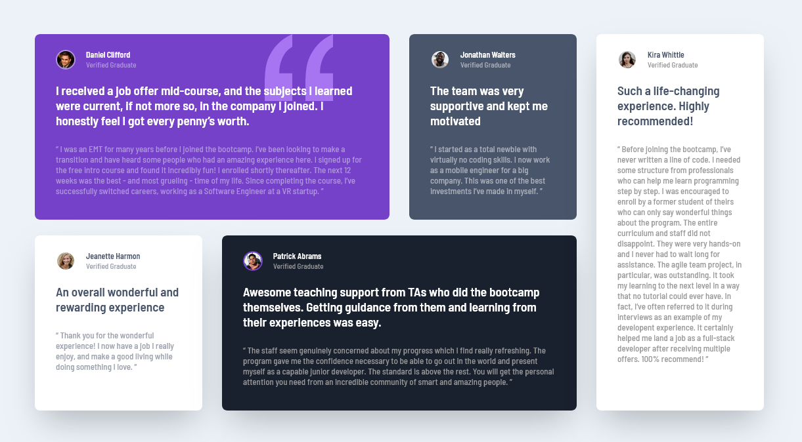

# Testimonials grid section solution (Tailwind CSS)

    

This is a solution to the [Testimonials grid section challenge on Frontend Mentor](https://www.frontendmentor.io/challenges/testimonials-grid-section-Nnw6J7Un7). Frontend Mentor challenges help you improve your coding skills by building realistic projects.

## Table of contents

-   [Overview](#overview)
    -   [The challenge](#the-challenge)
    -   [Screenshot](#screenshot)
    -   [Links](#links)
-   [My process](#my-process)
    -   [Built with](#built-with)
-   [Author](#author)

## Overview

### The challenge

Users should be able to:

-   View the optimal layout for the site depending on their device's screen size

### Screenshot

### Links

-   [Solution URL](https://github.com/adamhm/frontend-mentor-challenges/tree/main/testimonials-grid-section-main/tailwind)
-   [Live Site URL](https://adamhm.github.io/fm/testimonials-grid-section/tailwind/)

## My process

### Built with

-   [Visual Studio Code](https://code.visualstudio.com/) - IDE
-   Semantic HTML5 markup
-   [TailwindCSS](https://tailwindcss.com/) - styling
-   Flexbox
-   CSS Grid
-   [Prettier](https://prettier.io/) - code formatting
-   [npm](https://npmjs.org) - package manager

## Author

-   [Website](https://adamhm.github.io)
