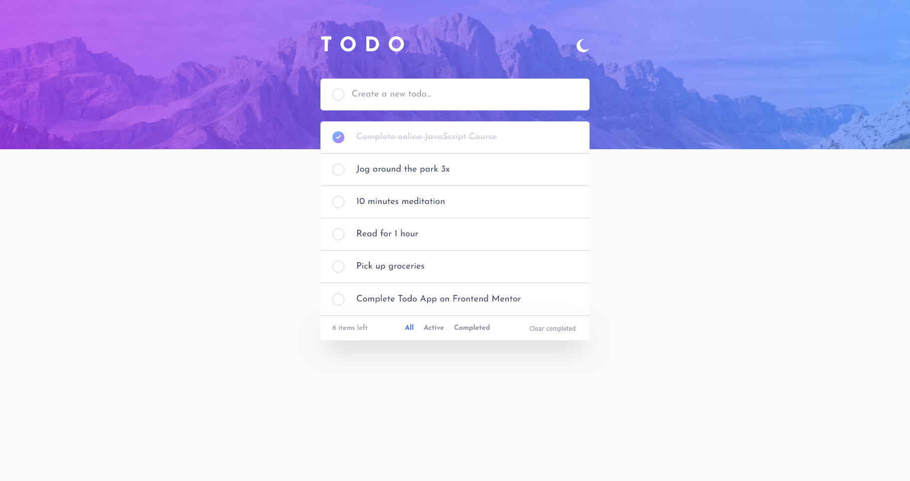
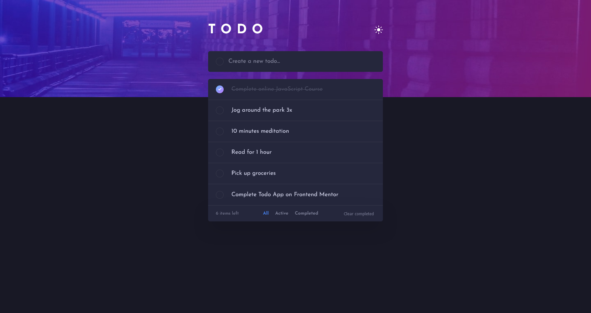

    
    

<h1 style="text-align: center">Todo app solution</h1>

 

         

This is a solution to the [Todo app challenge on Frontend Mentor](https://www.frontendmentor.io/challenges/todo-app-Su1_KokOW). Frontend Mentor challenges help you improve your coding skills by building realistic projects.

## Table of contents

-   [Overview](#overview)
    -   [The challenge](#the-challenge)
    -   [Screenshots](#screenshots)
    -   [Links](#links)
-   [My process](#my-process)
    -   [Built with](#built-with)
    -   [What I learned](#what-i-learned)
    -   [Useful resources](#useful-resources)
-   [Author](#author)

## Overview

### The challenge

Users should be able to:

-   View the optimal layout for the app depending on their device's screen size
-   See hover states for all interactive elements on the page
-   Add new todos to the list
-   Mark todos as complete
-   Delete todos from the list
-   Filter by all/active/complete todos
-   Clear all completed todos
-   Toggle light and dark mode
-   **Bonus**: Drag and drop to reorder items on the list

### Screenshots

### Links

-   [Solution URL](https://github.com/adamhm/frontend-mentor-challenges/tree/main/todo-app-main/todo-app-react-ts-scss)
-   [Live Site URL](https://adamhm.github.io/fm/todo-app/)

## My process

### Built with

-   [Visual Studio Code](https://code.visualstudio.com/) - IDE
-   Semantic HTML5 markup
-   [SASS](https://sass-lang.com/) - for styles
-   Flexbox
-   [React](https://reactjs.org/) - JS library
-   [ESLint](https://eslint.org/) - for linting
-   [Prettier](https://prettier.io/) - code formatting
-   [Vite](https://vitejs.dev) - as build tool
-   [npm](https://www.npmjs.com/) - package manager

### What I learned

-   How to create a custom React hook to check whether the browser is in mobile view...
-   How to use React Context API to implement dark mode...
-   How to use Typescript exhaustive checking in reducers...

### Useful resources

-   [Exhaustive Type Checking with TypeScript](https://dev.to/babak/exhaustive-type-checking-with-typescript-4l3f) - A nice concept to help us write safer switch statements

## Author

-   [Website](https://adamhm.github.io)
